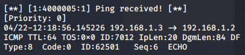
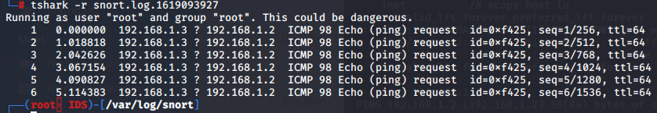
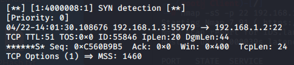
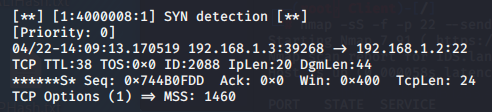

# Teaching-HEIGVD-SRX-2021-Laboratoire-Snort

Auteurs: Alexandra Cerottini & Fiona Gamboni

**Ce travail de laboratoire est à faire en équipes de 2 personnes**

**ATTENTION : Commencez par créer un Fork de ce repo et travaillez sur votre fork.**

Clonez le repo sur votre machine. Vous pouvez répondre aux questions en modifiant directement votre clone du README.md ou avec un fichier pdf que vous pourrez uploader sur votre fork.

**Le rendu consiste simplement à répondre à toutes les questions clairement identifiées dans le text avec la mention "Question" et à les accompagner avec des captures. Le rendu doit se faire par une "pull request". Envoyer également le hash du dernier commit et votre username GitHub par email au professeur et à l'assistant**

## Table de matières

[Introduction](#introduction)

[Echéance](#echéance)

[Démarrage de l'environnement virtuel](#démarrage-de-lenvironnement-virtuel)

[Communication avec les conteneurs](#communication-avec-les-conteneurs)

[Configuration de la machine IDS et installation de Snort](#configuration-de-la-machine-ids-et-installation-de-snort)

[Essayer Snort](#essayer-snort)

[Utilisation comme IDS](#utilisation-comme-un-ids)

[Ecriture de règles](#ecriture-de-règles)

[Travail à effectuer](#exercises)

[Cleanup](#cleanup)


## Echéance 

Ce travail devra être rendu au plus tard, **le 29 avril 2021 à 23h59.**


## Introduction

Dans ce travail de laboratoire, vous allez explorer un système de détection contre les intrusions (IDS) dont l'utilisation es très répandue grâce au fait qu'il est gratuit et open source. Il s'appelle [Snort](https://www.snort.org). Il existe des versions de Snort pour Linux et pour Windows.

### Les systèmes de détection d'intrusion

Un IDS peut "écouter" tout le traffic de la partie du réseau où il est installé. Sur la base d'une liste de règles, il déclenche des actions sur des paquets qui correspondent à la description de la règle.

Un exemple de règle pourrait être, en langage commun : "donner une alerte pour tous les paquets envoyés par le port http à un serveur web dans le réseau, qui contiennent le string 'cmd.exe'". En on peut trouver des règles très similaires dans les règles par défaut de Snort. Elles permettent de détecter, par exemple, si un attaquant essaie d'éxecuter un shell de commandes sur un serveur Web tournant sur Windows. On verra plus tard à quoi ressemblent ces règles.

Snort est un IDS très puissant. Il est gratuit pour l'utilisation personnelle et en entreprise, où il est très utilisé aussi pour la simple raison qu'il est l'un des systèmes IDS des plus efficaces.

Snort peut être exécuté comme un logiciel indépendant sur une machine ou comme un service qui tourne après chaque démarrage. Si vous voulez qu'il protège votre réseau, fonctionnant comme un IPS, il faudra l'installer "in-line" avec votre connexion Internet. 

Par exemple, pour une petite entreprise avec un accès Internet avec un modem simple et un switch interconnectant une dizaine d'ordinateurs de bureau, il faudra utiliser une nouvelle machine éxecutant Snort et placée entre le modem et le switch. 


## Matériel

Vous avez besoin de votre ordinateur avec Docker et docker-compose. Vous trouverez tous les fichiers nécessaires pour générer l'environnement pour virtualiser ce labo dans le projet que vous avez cloné.


## Démarrage de l'environnement virtuel

Ce laboratoire utilise docker-compose, un outil pour la gestion d'applications utilisant multiples conteneurs. Il va se charger de créer un réseaux virtuel `lan`, la machine IDS et une machine "Client". Le réseau LAN interconnecte les deux machines (voir schéma ci-dessous).


Nous allons commencer par lancer docker-compose. Il suffit de taper la commande suivante dans le répertoire racine du labo, celui qui contient le fichier [docker-compose.yml](docker-compose.yml). Optionnelement vous pouvez lancer le script [up.sh](scripts/up.sh) qui se trouve dans le répertoire [scripts](scripts), ainsi que d'autres scripts utiles pour vous :

```bash
docker-compose up --detach
```

Le téléchargement et génération des images prend peu de temps. 

Les images utilisées pour les conteneurs sont basées sur l'image officielle Kali. Le fichier [Dockerfile](Dockerfile) que vous avez téléchargé contient les informations nécessaires pour la génération de l'image de base. [docker-compose.yml](docker-compose.yml) l'utilise comme un modèle pour générer les conteneurs. Vous pouvez vérifier que les deux conteneurs sont crées et qu'ils fonctionnent à l'aide de la commande suivante.

```bash
docker ps
```

## Communication avec les conteneurs

Afin de simplifier vos manipulations, les conteneurs ont été configurées avec les noms suivants :

- IDS
- Client

Pour accéder au terminal de l’une des machines, il suffit de taper :

```bash
docker exec -it <nom_de_la_machine> /bin/bash
```

Par exemple, pour ouvrir un terminal sur votre IDS :

```bash
docker exec -it IDS /bin/bash
```

Optionnelement, vous pouvez utiliser les scripts [openids.sh](scripts/openids.sh) et [openclient.sh](scripts/openclient.sh) pour contacter les conteneurs.

Vous pouvez bien évidemment lancer des terminaux avec les deux machines en même temps ou même lancer plusieurs terminaux sur la même machine. ***Il est en fait conseillé pour ce laboratoire de garder au moins deux terminaux ouverts sur la machine IDS en tout moment***.


### Configuration de la machine Client

Dans un terminal de votre machine Client, taper les commandes suivantes :

```bash
ip route del default 
ip route add default via 192.168.1.2
```

Ceci configure la machine IDS comme la passerelle par défaut pour la machine Client.


## Configuration de la machine IDS et installation de Snort

Pour permettre à votre machine Client de contacter l'Internet à travers la machine IDS, il faut juste une petite règle NAT :

```bash
iptables -t nat -A POSTROUTING -o eth0 -j MASQUERADE
```

Cette commande `iptables` définit une règle dans le tableau NAT qui permet la redirection de ports et donc, l'accès à l'Internet pour la machine Client.

On va maintenant installer Snort sur le conteneur IDS.

La manière la plus simple c'est d'installer Snort en ligne de commandes. Il suffit d'utiliser la commande suivante :

```
apt install snort
```

Ceci télécharge et installe la version la plus récente de Snort.

Il est possible que vers la fin de l'installation, on vous demande de fournir deux informations :

- Le nom de l'interface sur laquelle snort doit surveiller - il faudra répondre ```eth0```
- L'adresse de votre réseau HOME. Il s'agit du réseau que vous voulez protéger. Cela sert à configurer certaines variables pour Snort. Vous pouvez répondre ```192.168.1.0/24```.


## Essayer Snort

Une fois installé, vous pouvez lancer Snort comme un simple "sniffer". Pourtant, ceci capture tous les paquets, ce qui peut produire des fichiers de capture énormes si vous demandez de les journaliser. Il est beaucoup plus efficace d'utiliser des règles pour définir quel type de trafic est intéressant et laisser Snort ignorer le reste.

Snort se comporte de différentes manières en fonction des options que vous passez en ligne de commande au démarrage. Vous pouvez voir la grande liste d'options avec la commande suivante :

```
snort --help
```

On va commencer par observer tout simplement les entêtes des paquets IP utilisant la commande :

```
snort -v -i eth0
```

**ATTENTION : le choix de l'interface devient important si vous avez une machine avec plusieurs interfaces réseau. Dans notre cas, vous pouvez ignorer entièrement l'option ```-i eth0```et cela devrait quand-même fonctionner correctement.**

Snort s'éxecute donc et montre sur l'écran tous les entêtes des paquets IP qui traversent l'interface eth0. Cette interface reçoit tout le trafic en provenance de la machine "Client" puisque nous avons configuré le IDS comme la passerelle par défaut.

Pour arrêter Snort, il suffit d'utiliser `CTRL-C` (**attention** : il peut arriver de temps à autres que Snort ne réponde pas correctement au signal d'arrêt. Dans ce cas-là, il faudra utiliser `kill` depuis un deuxième terminal pour arrêter le process).

## Utilisation comme un IDS

Pour enregistrer seulement les alertes et pas tout le trafic, on execute Snort en mode IDS. Il faudra donc spécifier un fichier contenant des règles. 

Il faut noter que `/etc/snort/snort.config` contient déjà des références aux fichiers de règles disponibles avec l'installation par défaut. Si on veut tester Snort avec des règles simples, on peut créer un fichier de config personnalisé (par exemple `mysnort.conf`) et importer un seul fichier de règles utilisant la directive "include".

Les fichiers de règles sont normalement stockes dans le répertoire `/etc/snort/rules/`, mais en fait un fichier de config et les fichiers de règles peuvent se trouver dans n'importe quel répertoire de la machine. 

Par exemple, créez un fichier de config `mysnort.conf` dans le repertoire `/etc/snort` avec le contenu suivant :

```
include /etc/snort/rules/icmp2.rules
```

Ensuite, créez le fichier de règles `icmp2.rules` dans le repertoire `/etc/snort/rules/` et rajoutez dans ce fichier le contenu suivant :

`alert icmp any any -> any any (msg:"ICMP Packet"; sid:4000001; rev:3;)`

On peut maintenant éxecuter la commande :

```
snort -c /etc/snort/mysnort.conf
```

Vous pouvez maintenant faire quelques pings depuis votre "Client" et regarder les résultas dans le fichier d'alertes contenu dans le repertoire `/var/log/snort/`.


## Ecriture de règles

Snort permet l'écriture de règles qui décrivent des tentatives de exploitation de vulnérabilités bien connues. Les règles Snort prennent en charge à la fois, l'analyse de protocoles et la recherche et identification de contenu.

Il y a deux principes de base à respecter :

* Une règle doit être entièrement contenue dans une seule ligne
* Les règles sont divisées en deux sections logiques : (1) l'entête et (2) les options.

L'entête de la règle contient l'action de la règle, le protocole, les adresses source et destination, et les ports source et destination.

L'option contient des messages d'alerte et de l'information concernant les parties du paquet dont le contenu doit être analysé. Par exemple:

```
alert tcp any any -> 192.168.1.0/24 111 (content:"|00 01 86 a5|"; msg: "mountd access";)
```

Cette règle décrit une alerte générée quand Snort trouve un paquet avec tous les attributs suivants :

* C'est un paquet TCP
* Emis depuis n'importe quelle adresse et depuis n'importe quel port
* A destination du réseau identifié par l'adresse 192.168.1.0/24 sur le port 111

Le text jusqu'au premier parenthèse est l'entête de la règle. 

```
alert tcp any any -> 192.168.1.0/24 111
```

Les parties entre parenthèses sont les options de la règle:

```
(content:"|00 01 86 a5|"; msg: "mountd access";)
```

Les options peuvent apparaître une ou plusieurs fois. Par exemple :

```
alert tcp any any -> any 21 (content:"site exec"; content:"%"; msg:"site
exec buffer overflow attempt";)
```

La clé "content" apparait deux fois parce que les deux strings qui doivent être détectés n'apparaissent pas concaténés dans le paquet mais a des endroits différents. Pour que la règle soit déclenchée, il faut que le paquet contienne **les deux strings** "site exec" et "%". 

Les éléments dans les options d'une règle sont traités comme un AND logique. La liste complète de règles sont traitées comme une succession de OR.

## Informations de base pour le règles

### Actions :

```
alert tcp any any -> any any (msg:"My Name!"; content:"Skon"; sid:1000001; rev:1;)
```

L'entête contient l'information qui décrit le "qui", le "où" et le "quoi" du paquet. Ça décrit aussi ce qui doit arriver quand un paquet correspond à tous les contenus dans la règle.

Le premier champ dans le règle c'est l'action. L'action dit à Snort ce qui doit être fait quand il trouve un paquet qui correspond à la règle. Il y a six actions :

* alert - générer une alerte et écrire le paquet dans le journal
* log - écrire le paquet dans le journal
* pass - ignorer le paquet
* drop - bloquer le paquet et l'ajouter au journal
* reject - bloquer le paquet, l'ajouter au journal et envoyer un `TCP reset` si le protocole est TCP ou un `ICMP port unreachable` si le protocole est UDP
* sdrop - bloquer le paquet sans écriture dans le journal

### Protocoles :

Le champ suivant c'est le protocole. Il y a trois protocoles IP qui peuvent être analysés par Snort : TCP, UDP et ICMP.


### Adresses IP :

La section suivante traite les adresses IP et les numéros de port. Le mot `any` peut être utilisé pour définir "n'import quelle adresse". On peut utiliser l'adresse d'une seule machine ou un block avec la notation CIDR. 

Un opérateur de négation peut être appliqué aux adresses IP. Cet opérateur indique à Snort d'identifier toutes les adresses IP sauf celle indiquée. L'opérateur de négation est le `!`.

Par exemple, la règle du premier exemple peut être modifiée pour alerter pour le trafic dont l'origine est à l'extérieur du réseau :

```
alert tcp !192.168.1.0/24 any -> 192.168.1.0/24 111
(content: "|00 01 86 a5|"; msg: "external mountd access";)
```

### Numéros de Port :

Les ports peuvent être spécifiés de différentes manières, y-compris `any`, une définition numérique unique, une plage de ports ou une négation.

Les plages de ports utilisent l'opérateur `:`, qui peut être utilisé de différentes manières aussi :

```
log udp any any -> 192.168.1.0/24 1:1024
```

Journaliser le traffic UDP venant d'un port compris entre 1 et 1024.

--

```
log tcp any any -> 192.168.1.0/24 :6000
```

Journaliser le traffic TCP venant d'un port plus bas ou égal à 6000.

--

```
log tcp any :1024 -> 192.168.1.0/24 500:
```

Journaliser le traffic TCP venant d'un port privilégié (bien connu) plus grand ou égal à 500 mais jusqu'au port 1024.


### Opérateur de direction

L'opérateur de direction `->`indique l'orientation ou la "direction" du trafique. 

Il y a aussi un opérateur bidirectionnel, indiqué avec le symbole `<>`, utile pour analyser les deux côtés de la conversation. Par exemple un échange telnet :

```
log 192.168.1.0/24 any <> 192.168.1.0/24 23
```

## Alertes et logs Snort

Si Snort détecte un paquet qui correspond à une règle, il envoie un message d'alerte ou il journalise le message. Les alertes peuvent être envoyées au syslog, journalisées dans un fichier text d'alertes ou affichées directement à l'écran.

Le système envoie **les alertes vers le syslog** et il peut en option envoyer **les paquets "offensifs" vers une structure de repertoires**.

Les alertes sont journalisées via syslog dans le fichier `/var/log/snort/alerts`. Toute alerte se trouvant dans ce fichier aura son paquet correspondant dans le même repertoire, mais sous le fichier `snort.log.xxxxxxxxxx` où `xxxxxxxxxx` est l'heure Unix du commencement du journal.

Avec la règle suivante :

```
alert tcp any any -> 192.168.1.0/24 111
(content:"|00 01 86 a5|"; msg: "mountd access";)
```

un message d'alerte est envoyé à syslog avec l'information "mountd access". Ce message est enregistré dans `/var/log/snort/alerts` et le vrai paquet responsable de l'alerte se trouvera dans un fichier dont le nom sera `/var/log/snort/snort.log.xxxxxxxxxx`.

Les fichiers log sont des fichiers binaires enregistrés en format pcap. Vous pouvez les ouvrir avec Wireshark ou les diriger directement sur la console avec la commande suivante :

```
tcpdump -r /var/log/snort/snort.log.xxxxxxxxxx
```

Vous pouvez aussi utiliser des captures Wireshark ou des fichiers snort.log.xxxxxxxxx comme source d'analyse por Snort.

## Exercises

**Réaliser des captures d'écran des exercices suivants et les ajouter à vos réponses.**

### Essayer de répondre à ces questions en quelques mots, en réalisant des recherches sur Internet quand nécessaire :

**Question 1: Qu'est ce que signifie les "preprocesseurs" dans le contexte de Snort ?**

---

**Réponse :**  Les préprocesseurs étendent la fonctionnalité de Snort en permettant aux utilisateurs et aux programmeurs d'y intégrer facilement des plugins modulaires. Grâce à ce mécanisme, les paquets peuvent être modifiés ou analysés de manière "out-of-band" avant que le mécanisme de détection ne soit lancé.

---

**Question 2: Pourquoi êtes vous confronté au WARNING suivant `"No preprocessors configured for policy 0"` lorsque vous exécutez la commande `snort` avec un fichier de règles ou de configuration "fait-maison" ?**

---

**Réponse :**  Car aucun préprocesseur n'a été configuré dans notre fichier de configuration. Il faut activer les préprocesseurs dans le fichier de configuration.

---

--

### Trouver du contenu :

Considérer la règle simple suivante:

alert tcp any any -> any any (msg:"Mon nom!"; content:"Rubinstein"; sid:4000015; rev:1;)

**Question 3: Qu'est-ce qu'elle fait la règle et comment ça fonctionne ?**

---

**Réponse :**  La règle génère une alerte lorsqu'un paquet TCP en provenance de n'importe où (adresses et ports) et à destination de n'importe où (adresses et ports) contient "Rubinstein". Le paquet sera écrit dans le journal.

---

Utiliser nano pour créer un fichier `myrules.rules` sur votre répertoire home (```/root```). Rajouter une règle comme celle montrée avant mais avec votre text, phrase ou mot clé que vous aimeriez détecter. Lancer Snort avec la commande suivante :

```
sudo snort -c myrules.rules -i eth0
```

**Question 4: Que voyez-vous quand le logiciel est lancé ? Qu'est-ce que tous ces messages affichés veulent dire ?**

---

**Réponse :**  

```
 --== Initializing Snort ==--
Initializing Output Plugins!
Initializing Preprocessors!
Initializing Plug-ins!
Parsing Rules file "myrules.rules"
Tagged Packet Limit: 256
Log directory = /var/log/snort

+++++++++++++++++++++++++++++++++++++++++++++++++++
Initializing rule chains...
1 Snort rules read
    1 detection rules
    0 decoder rules
    0 preprocessor rules
1 Option Chains linked into 1 Chain Headers
+++++++++++++++++++++++++++++++++++++++++++++++++++

+-------------------[Rule Port Counts]---------------------------------------
|             tcp     udp    icmp      ip
|     src       0       0       0       0
|     dst       0       0       0       0
|     any       1       0       0       0
|      nc       0       0       0       0
|     s+d       0       0       0       0
+----------------------------------------------------------------------------

+-----------------------[detection-filter-config]------------------------------
| memory-cap : 1048576 bytes
+-----------------------[detection-filter-rules]-------------------------------
| none
-------------------------------------------------------------------------------

+-----------------------[rate-filter-config]-----------------------------------
| memory-cap : 1048576 bytes
+-----------------------[rate-filter-rules]------------------------------------
| none
-------------------------------------------------------------------------------

+-----------------------[event-filter-config]----------------------------------
| memory-cap : 1048576 bytes
+-----------------------[event-filter-global]----------------------------------
+-----------------------[event-filter-local]-----------------------------------
| none
+-----------------------[suppression]------------------------------------------
| none
-------------------------------------------------------------------------------
Rule application order: pass->drop->sdrop->reject->alert->log
Verifying Preprocessor Configurations!

[ Port Based Pattern Matching Memory ]
+-[AC-BNFA Search Info Summary]------------------------------
| Instances        : 1
| Patterns         : 1
| Pattern Chars    : 7
| Num States       : 7
| Num Match States : 1
| Memory           :   1.60Kbytes
|   Patterns       :   0.04K
|   Match Lists    :   0.09K
|   Transitions    :   1.07K
+-------------------------------------------------
pcap DAQ configured to passive.
Acquiring network traffic from "eth0".
Reload thread starting...
Reload thread started, thread 0x7fe1191bc700 (1177)
Decoding Ethernet

        --== Initialization Complete ==--

   ,,_     -*> Snort! <*-
  o"  )~   Version 2.9.15.1 GRE (Build 15125) 
   ''''    By Martin Roesch & The Snort Team: http://www.snort.org/contact#team
           Copyright (C) 2014-2019 Cisco and/or its affiliates. All rights reserved.
           Copyright (C) 1998-2013 Sourcefire, Inc., et al.
           Using libpcap version 1.10.0 (with TPACKET_V3)
           Using PCRE version: 8.39 2016-06-14
           Using ZLIB version: 1.2.11
```

À l'initialisation, Snort: 

- initialise les plugins et préprocesseurs

- parse le fichier de règles: `Parsing Rules file "myrules.rules"`

- le log directory est `/var/log/snort`

Snort initialise ensuite les règles. On voit que Snort a lu notre règle: `1 Snort rules read`. C'est une règle de détection.

Dans le tableau `Rule Port Counts`, on voit que la règle agit sur le protocole TCP pour n'importe qu'elle source et destination.

Ensuite, il décrit les filtres et vérifie les configurations du préprocesseur.

Il récupère le trafic du réseau spécifié. Ici, `eth0`.

L'initialisation est ainsi terminée.

---

Aller à un site web contenant dans son text la phrase ou le mot clé que vous avez choisi (il faudra chercher un peu pour trouver un site en http... Si vous n'y arrivez pas, vous pouvez utiliser [http://neverssl.com](http://neverssl.com) et modifier votre votre règle pour détecter un morceau de text contenu dans le site).

**Question 5: Que voyez-vous sur votre terminal quand vous chargez le site depuis la machine Client? (vous pouvez utiliser wget pour lancer la requête http ou le navigateur Web lynx - il suffit de taper ```lynx neverssl.com```. Le navigateur lynx est un navigateur basé sur text, sans interface graphique)**

---

**Réponse :**  

```
Commencing packet processing (pid=1201)
WARNING: No preprocessors configured for policy 0.
WARNING: No preprocessors configured for policy 0.
...
```

Comme on n'active toujours pas de préprocesseurs dans notre fichier de règle, le warning est toujours présent. (CF. question 2)

---

Arrêter Snort avec `CTRL-C`.

**Question 6: Que voyez-vous quand vous arrêtez snort ? Décrivez en détail toutes les informations qu'il vous fournit.**

---

**Réponse :**  

```
*** Caught Int-Signal
WARNING: No preprocessors configured for policy 0.
===============================================================================
Run time for packet processing was 38.14893 seconds
Snort processed 47 packets.
Snort ran for 0 days 0 hours 0 minutes 38 seconds
   Pkts/sec:            1
===============================================================================
Memory usage summary:
  Total non-mmapped bytes (arena):       4096000
  Bytes in mapped regions (hblkhd):      30265344
  Total allocated space (uordblks):      3346688
  Total free space (fordblks):           749312
  Topmost releasable block (keepcost):   591872
===============================================================================
Packet I/O Totals:
   Received:           50
   Analyzed:           47 ( 94.000%)
    Dropped:            0 (  0.000%)
   Filtered:            0 (  0.000%)
Outstanding:            3 (  6.000%)
   Injected:            0
===============================================================================
Breakdown by protocol (includes rebuilt packets):
        Eth:           47 (100.000%)
       VLAN:            0 (  0.000%)
        IP4:           45 ( 95.745%)
       Frag:            0 (  0.000%)
       ICMP:            1 (  2.128%)
        UDP:           16 ( 34.043%)
        TCP:           28 ( 59.574%)
        IP6:            0 (  0.000%)
    IP6 Ext:            0 (  0.000%)
   IP6 Opts:            0 (  0.000%)
      Frag6:            0 (  0.000%)
      ICMP6:            0 (  0.000%)
       UDP6:            0 (  0.000%)
       TCP6:            0 (  0.000%)
     Teredo:            0 (  0.000%)
    ICMP-IP:            0 (  0.000%)
    IP4/IP4:            0 (  0.000%)
    IP4/IP6:            0 (  0.000%)
    IP6/IP4:            0 (  0.000%)
    IP6/IP6:            0 (  0.000%)
        GRE:            0 (  0.000%)
    GRE Eth:            0 (  0.000%)
   GRE VLAN:            0 (  0.000%)
    GRE IP4:            0 (  0.000%)
    GRE IP6:            0 (  0.000%)
GRE IP6 Ext:            0 (  0.000%)
   GRE PPTP:            0 (  0.000%)
    GRE ARP:            0 (  0.000%)
    GRE IPX:            0 (  0.000%)
   GRE Loop:            0 (  0.000%)
       MPLS:            0 (  0.000%)
        ARP:            2 (  4.255%)
        IPX:            0 (  0.000%)
   Eth Loop:            0 (  0.000%)
   Eth Disc:            0 (  0.000%)
   IP4 Disc:            0 (  0.000%)
   IP6 Disc:            0 (  0.000%)
   TCP Disc:            0 (  0.000%)
   UDP Disc:            0 (  0.000%)
  ICMP Disc:            0 (  0.000%)
All Discard:            0 (  0.000%)
      Other:            0 (  0.000%)
Bad Chk Sum:           22 ( 46.809%)
    Bad TTL:            0 (  0.000%)
     S5 G 1:            0 (  0.000%)
     S5 G 2:            0 (  0.000%)
      Total:           47
===============================================================================
Action Stats:
     Alerts:            2 (  4.255%)
     Logged:            2 (  4.255%)
     Passed:            0 (  0.000%)
Limits:
      Match:            0
      Queue:            0
        Log:            0
      Event:            0
      Alert:            0
Verdicts:
      Allow:           47 ( 94.000%)
      Block:            0 (  0.000%)
    Replace:            0 (  0.000%)
  Whitelist:            0 (  0.000%)
  Blacklist:            0 (  0.000%)
     Ignore:            0 (  0.000%)
      Retry:            0 (  0.000%)
===============================================================================
Snort exiting
```

Première partie: nous permet de savoir le temps d'exécution, le nombre de paquets traité ainsi que le nombre de paquet traité par seconde.

Deuxième partie: nous fournit un résumé de l'usage de la mémoire.

Troisième partie: nous donne des informations supplémentaires sur les paquets. Dans notre cas, nous avons reçus 50 paquets. 47 ont été analysés et 3 sont restés en suspens. Aucun n'a été filtré ou écarté.

Quatrième partie: nous montre les paquets selon leurs protocoles.

Cinquième partie: nous montre les statistiques du traitement. Nous voyons que nous avons reçu deux alertes qui ont été loguées. 47 paquets ont été autorisés.

---


Aller au répertoire /var/log/snort. Ouvrir le fichier `alert`. Vérifier qu'il y ait des alertes pour votre text choisi.

**Question 7: A quoi ressemble l'alerte ? Qu'est-ce que chaque élément de l'alerte veut dire ? Décrivez-la en détail !**

---

**Réponse :**  

```
[**] [1:4000015:1] NeverSSL vu! [**]
[Priority: 0] 
04/15-14:55:04.546792 13.224.89.198:80 -> 192.168.1.3:60290
TCP TTL:62 TOS:0x0 ID:31135 IpLen:20 DgmLen:1460
***AP*** Seq: 0x389849E3  Ack: 0x54C7133B  Win: 0xFFFF  TcpLen: 20
```

La ligne`[**] [1:4000015:1] NeverSSL vu! [**]` identifie la règle. On y voit le SID, le numéro de révision ainsi que le message défini dans notre règle d'alerte.

La ligne `[Priority: 0]` indique la priorité de la règle. Elle est par défaut à 0.

La ligne `04/15-14:55:04.546792 13.224.89.198:80 -> 192.168.1.3:60290` indique la date et l'heure de l'alerte ainsi que l'adresse IP et port source et l'adresse IP et port de destination.

La ligne `TCP TTL:62 TOS:0x0 ID:31135 IpLen:20 DgmLen:1460` fournit les informations de l'entête du paquet IP. On y retrouve le protocole (TCP), le time to live (TTL), le type of service (TOS), l'ID du paquet (ID), la taille de l'entête du paquet (IpLen) et la taille du paquet (DgmLen).

La ligne `***AP*** Seq: 0x389849E3  Ack: 0x54C7133B  Win: 0xFFFF  TcpLen: 20` fournit les informations de l'entête du segment TCP. On y retrouve le numéro de séquence (Seq), le numéro d'acquittement (Ack), la taille de la fenêtre (Win) et la taille de l'entête (TcpLen).

---


--

### Detecter une visite à Wikipedia

Ecrire une règle qui journalise (sans alerter) un message à chaque fois que Wikipedia est visité **SPECIFIQUEMENT DEPUIS VOTRE MACHINE CLIENT**. Ne pas utiliser une règle qui détecte un string ou du contenu**.

**Question 8: Quelle est votre règle ? Où le message a-t'il été journalisé ? Qu'est-ce qui a été journalisé ?**

---

**Réponse :**  

```
log tcp 192.168.1.3 any -> 91.198.174.192 [80,443] (msg:"Wikipedia visited!"; sid:4000004; rev:1;)
```

Le message a été journalisé dans le répertoire `var/log/snort` dans le fichier `snort.log.1618502759`. 

Ce sont les paquets TCP à destination de wikipedia.org qui ont été journalisé.

---

--

### Détecter un ping d'un autre système

Ecrire une règle qui alerte à chaque fois que votre machine IDS reçoit un ping depuis une autre machine (la seule autre machine que vous avez à disposition c'est la machine Client). Assurez-vous que **ça n'alerte pas** quand c'est vous qui envoyez le ping depuis l'IDS vers un autre système !

**Question 9: Quelle est votre règle ?**

---

**Réponse :**  

```
alert icmp any any -> 192.168.1.2 any (msg:"Ping received!";itype:8;sid:4000005;rev:1;)
```

---


**Question 10: Comment avez-vous fait pour que ça identifie seulement les pings entrants ?**

---

**Réponse :**  

En utilisant l'option `itype:8` permettant de traiter uniquement les echo request. La règle ne s'appliquera pas sur les réponses des pings.

---


**Question 11: Où le message a-t-il été journalisé ?**

---

**Réponse :**  

Dans `/var/log/snort/alert`



---

**Question 12: Qu'est-ce qui a été journalisé ? (vous pouvez lire les fichiers log utilisant la commande `tshark -r nom_fichier_log` **

---

**Réponse :**  

Les pings echo request (dans ce cas en provenance de la machine Client vers l'IDS) ont été journalisé dans le fichier log.



---

--

### Detecter les ping dans les deux sens

Faites le nécessaire pour que les pings soient détectés dans les deux sens.

**Question 13: Qu'est-ce que vous avez fait pour détecter maintenant le trafic dans les deux sens ?**

---

**Réponse :**  

```
alert icmp any any <> 192.168.1.2 any (msg:"Ping received!";sid:4000006;rev:1;)
```

Nous avons modifié l'opérateur de direction pour que les deux sens soient compris. De plus, nous avons supprimé l'option `itype:8` pour que les echo request et echo response soient prises en compte.

---

--

### Detecter une tentative de login SSH

Essayer d'écrire une règle qui Alerte qu'une tentative de session SSH a été faite depuis la machine Client sur l'IDS.

**Question 14: Quelle est votre règle ? Montrer la règle et expliquer en détail comment elle fonctionne.**

---

**Réponse :**  

```
alert tcp 192.168.1.3 any -> 192.168.1.2 22 (msg:"Attempting SSH connection from Client";flags:S;sid:4000007;rev:1;)
```

Sachant que le protocole SSH utilise le port TCP 22, on alerte si une tentative de connexion depuis le client (192.168.1.3) avec n'importe quel port vers l'IDS (192.168.1.2) sur le port 22 tente d'être établie (le flag `S` vérifie qu'il y a eu un SYN 

---

**Question 15: Montrer le message enregistré dans le fichier d'alertes.** 

---

**Réponse :**  

Le message ne s'enregistre pas dans le fichier d'alerte. Nous avons demandé des explications au professeur qui a le même problème chez lui.

---

--

### Analyse de logs

Depuis l'IDS, servez-vous de l'outil ```tshark```pour capturer du trafic dans un fichier. ```tshark``` est une version en ligne de commandes de ```Wireshark```, sans interface graphique. 

Pour lancer une capture dans un fichier, utiliser la commande suivante :

```
tshark -w nom_fichier.pcap
```

Générez du trafic depuis le deuxième terminal qui corresponde à l'une des règles que vous avez ajoutées à votre fichier de configuration personnel. Arrêtez la capture avec ```Ctrl-C```.

**Question 16: Quelle est l'option de Snort qui permet d'analyser un fichier pcap ou un fichier log ?**

---

**Réponse :**  

L'option `-r`.

---

Utiliser l'option correcte de Snort pour analyser le fichier de capture Wireshark que vous venez de générer.

**Question 17: Quelle est le comportement de Snort avec un fichier de capture ? Y-a-t'il une différence par rapport à l'analyse en temps réel ?**

---

**Réponse :**  

On redirige l'analyse du trafic dans un fichier pcap où les règles seront appliquées. On lit ensuite le fichier pcap avec Snort qui va afficher les informations. Il n'y a donc pas de différence entre la lecture d'un fichier de capture et l'analyse en temps réel.

---

**Question 18: Est-ce que des alertes sont aussi enregistrées dans le fichier d'alertes?**

---

**Réponse :**  

Non. 

---

--

### Contournement de la détection

Faire des recherches à propos des outils `fragroute` et `fragrouter`.

**Question 19: A quoi servent ces deux outils ?**

---

**Réponse :**  

fragroute permet d'intercepter, de modifier et de réécrire le trafic de sortie destiné à un hôte spécifique.

fragrouter est une boîte à outils d'évasion de détection d'intrusion dans le réseau.

---


**Question 20: Quel est le principe de fonctionnement ?**

---

**Réponse :**  

On définit des règles dans un fichier de configuration qui permettent notamment de retarder, dupliquer, refuser et segmenter les paquets sortant destiné à un hôte spécifique.

---


**Question 21: Qu'est-ce que le `Frag3 Preprocessor` ? A quoi ça sert et comment ça fonctionne ?**

---

**Réponse :**  

Le préprocesseur frag3 est un module de défragmentation IP basé sur les cibles pour Snort. Frag3 est conçu avec les objectifs suivants :

1) Une exécution plus rapide avec une gestion des données moins complexe.

2) Techniques anti-évasion de modélisation de l'hôte basées sur la cible.

Frag3 utilise la structure de données sfxhash et les listes liées pour la gestion des données en interne, ce qui lui permet d'avoir des performances beaucoup plus prévisibles et déterministes dans n'importe quel environnement, ce qui devrait nous aider à gérer les environnements fortement fragmentés.

Lien:  https://www.snort.org/faq/readme-frag3 

---


L'utilisation des outils ```Fragroute``` et ```Fragrouter``` nécessite une infrastructure un peu plus complexe. On va donc utiliser autre chose pour essayer de contourner la détection.

L'outil nmap propose une option qui fragmente les messages afin d'essayer de contourner la détection des IDS. Générez une règle qui détecte un SYN scan sur le port 22 de votre IDS.


**Question 22: A quoi ressemble la règle que vous avez configurée ?**

---

**Réponse :**  

```
alert tcp any any -> 192.168.1.2 22 (msg:"SYN detection";flags:S;sid:4000008;rev:1;)
```


---


Ensuite, servez-vous du logiciel nmap pour lancer un SYN scan sur le port 22 depuis la machine Client :

```
nmap -sS -p 22 192.168.1.2
```
Vérifiez que votre règle fonctionne correctement pour détecter cette tentative. 

Ensuite, modifiez votre commande nmap pour fragmenter l'attaque :

```
nmap -sS -f -p 22 --send-eth 192.168.1.2
```

**Question 23: Quel est le résultat de votre tentative ?**

---

**Réponse :**  

Résultat de `nmap -sS -p 22 192.168.1.2`:



L'alerte a été journalisée.

Résultat de `nmap -sS -f -p 22 --send-eth 192.168.1.2`:

L'alerte n'a pas été journalisée. On a pu contourner la détection grâce à la fragmentation.

---


Modifier le fichier `myrules.rules` pour que snort utiliser le `Frag3 Preprocessor` et refaire la tentative.

**Question 24: Quel est le résultat ?**

---

**Réponse :**  

L'alerte est cette fois-ci journalisée avec la commande `nmap -sS -f -p 22 --send-eth 192.168.1.2` car le préprocesseur permet de défragmenter le message.



---


**Question 25: A quoi sert le `SSL/TLS Preprocessor` ?**

---

**Réponse :**  

Le SSL/TLS préprocesseur permet d'ignorer le trafic chiffré pour des raisons de performances et pour réduire les faux positifs.

---


**Question 26: A quoi sert le `Sensitive Data Preprocessor` ?**

---

**Réponse :**  

Le Sensitive Data préprocesseur est un module Snort qui effectue la détection et le filtrage des informations personnelles identifiables. Comme par exemple, les numéros de carte de crédit, les numéros de sécurité sociale (États-Unis) et les adresses mails. On peut également définir nos propres informations personnelles identifiables.

---

### Conclusions


**Question 27: Donnez-nous vos conclusions et votre opinion à propos de snort**

---

**Réponse :**  

Ce laboratoire nous a permis de découvrir le NIDS snort. Au fil du laboratoire, nous nous sommes familiarisées avec l'écriture de règles basiques et avons bien compris leur fonctionnement. Bien que nous ne l'ayons pas directement expérimenté, nous avons remarqué que Snort peut permettre d'établir des règles bien plus conséquentes et puissantes, notamment à l'aide des divers préprocesseurs. Ainsi, Snort dans toute ses capacités peut permettre une analyse poussée du trafic.

---

### Cleanup

Pour nettoyer votre système et effacer les fichiers générés par Docker, vous pouvez exécuter le script [cleanup.sh](scripts/cleanup.sh). **ATTENTION : l'effet de cette commande est irréversible***.


<sub>This guide draws heavily on http://cs.mvnu.edu/twiki/bin/view/Main/CisLab82014</sub>